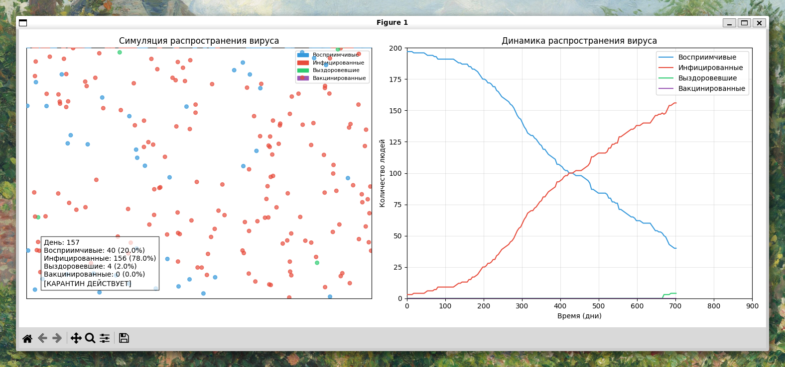
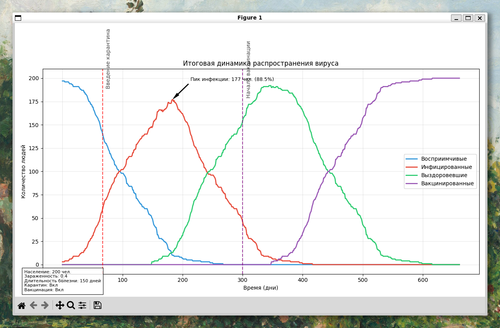

# epidemica

## Описание

Проект представляет собой агентную модель распространения вируса в популяции. 
Каждый агент (человек) представлен точкой на плоскости, движущейся в случайном направлении.
Заражение происходит при контакте здорового агента с инфицированным.

## Особенности модели

- Реалистичное моделирование движения людей в пространстве
- Четыре состояния для каждого агента: восприимчивый, инфицированный, выздоровевший, вакцинированный
- Временный иммунитет после выздоровления
- Возможность включения и настройки карантина
- Возможность вакцинации части населения

## Структура проекта

- `main.py` - основной файл запуска симуляции
- `population.py` - реализация класса популяции и логики распространения вируса
- `visualization.py` - визуализация симуляции в реальном времени

## Как запустить

```
python main.py
```

## Параметры симуляции

Основные настройки модели находятся в файле `main.py`. Вы можете изменить:

- `POPULATION_SIZE` - размер популяции
- `INITIAL_INFECTED` - начальное число зараженных
- `INFECTION_RATE` - вероятность заражения при контакте
- `RECOVERY_TIME` - длительность болезни (в шагах)
- `IMMUNITY_TIME` - длительность иммунитета после выздоровления
- `QUARANTINE_ENABLED` - включить/выключить карантин
- `QUARANTINE_THRESHOLD` - процент зараженных для ввода карантина
- `VACCINATION_ENABLED` - включить/выключить вакцинацию
- `VACCINATION_START` - время начала вакцинации
- `VACCINATION_RATE` - количество вакцинируемых человек за шаг

## Внешний вид
Вот так выглядит симуляция распространения вируса:  


После завершения работы генерируется график с динамикой популяции:  


## Результаты

После завершения симуляции программа выводит итоговый график с динамикой распространения вируса и основными показателями:

```
=== ЗАПУСК СИМУЛЯЦИИ РАСПРОСТРАНЕНИЯ ВИРУСА ===
Размер популяции: 200
Начальное число зараженных: 3
Вероятность заражения: 0.4
Карантин: Включен
Вакцинация: Включена
День 69: Введен карантин (заражено 30.0% населения)
День 312: Карантин снят (заражено 14.0% населения)

==== РЕЗУЛЬТАТЫ СИМУЛЯЦИИ ====
Продолжительность: 662 шагов
Максимум зараженных: 177 человек (88.5%)
Время выполнения: 26.30 сек.
```

### Ключевые моменты:
- Количество восприимчивых, инфицированных, выздоровевших и вакцинированных людей
- Момент введения карантина
- Момент начала вакцинации
- Пиковое число инфицированных

## Примечания

Код написан в учебных целях и не претендует на точное эпидемиологическое моделирование.
